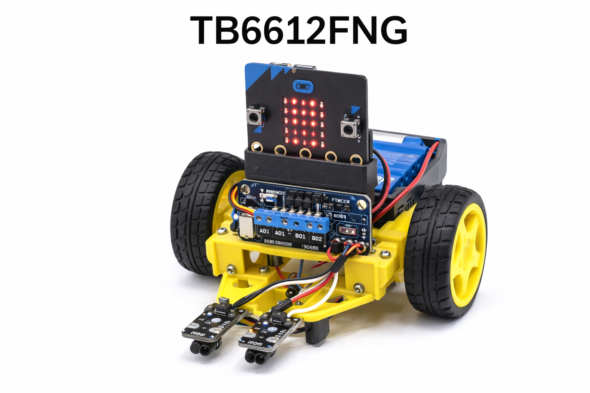

# Extension RobotClub – TB6612FNG + Ultrason (micro:bit)

*(L’image peut ne pas s’afficher dans MakeCode, ce n’est pas grave.)*  

---

## Objectif
Cette extension permet de piloter **2 moteurs DC** via un **driver TB6612FNG** avec un câblage **fixe** (RobotClub)  
et d’utiliser un **capteur ultrason** (TRIG/ECHO) pour détecter un obstacle.

---

# 1) Câblage moteurs (micro:bit ↔ TB6612FNG ↔ moteurs)

## Alimentation (obligatoire)
- **VCC (TB6612)** → **3V (micro:bit)**  
- **GND (TB6612)** → **GND (micro:bit)**  
- **VM (TB6612)** → **+ Batterie moteurs** (ex : 6V à 9V)  
- **GND Batterie** → **GND commun** (même masse que micro:bit et TB6612)  
- **STBY (TB6612)** → **3V (micro:bit)** ✅ indispensable (sinon les moteurs ne tournent pas)

⚠️ **Toutes les masses (GND) doivent être reliées ensemble** : micro:bit + TB6612 + batterie.

---

## Broches utilisées (câblage fixe)

### Moteur gauche (Moteur A sur TB6612)
- **AIN1** → **P13**
- **AIN2** → **P14**
- **PWMA** → **P15**
- **A01 / A02** → bornes du **moteur gauche**

### Moteur droit (Moteur B sur TB6612)
- **BIN1** → **P8**
- **BIN2** → **P12**
- **PWMB** → **P16**
- **B01 / B02** → bornes du **moteur droit**

---

# 2) Câblage Ultrason (micro:bit ↔ capteur)

## Broches Ultrason (câblage fixe RobotClub)
- **TRIG** → **P1**
- **ECHO** → **P2**
- **GND** → **GND commun**
- **VCC** → dépend du modèle du capteur

---

## ⚠️ Cas du HC-SR04 (très courant)
Le HC-SR04 fonctionne en **5V** et son pin **ECHO sort du 5V**.  
Le micro:bit accepte max **3.3V** sur ses entrées.

✅ Donc si tu utilises un HC-SR04 :
- **VCC capteur → 5V externe**
- **GND capteur → GND commun**
- **TRIG → P1**
- **ECHO → P2 via un diviseur de tension** (obligatoire)

### Diviseur de tension conseillé (simple)
- **R1 = 1 kΩ** (entre ECHO et P2)
- **R2 = 2 kΩ** (entre P2 et GND)

Cela ramène ~5V vers ~3.3V.

✅ Si tu as un capteur ultrason **compatible 3.3V**, pas besoin de diviseur.

---

# 3) Blocs disponibles

## Moteurs
- **moteur gauche … moteur droit …** : réglage direct en % (**-100..100**)
- **arrêter les moteurs**
- **avancer à … de puissance**
- **reculer à … de puissance**
- **tourner à gauche à … de puissance**
- **tourner à droite à … de puissance**

## Ultrason
- **distance ultrason (cm)** : renvoie la distance en centimètres
- **obstacle à moins de … cm**
- **obstacle à plus de … cm**
- **obstacle entre … cm et … cm**

---

# 4) Dépannage rapide

✅ Si un moteur ne tourne pas :
1. Vérifier que **STBY est bien relié au 3V**
2. Vérifier **PWMA/PWMB** (P15 / P16)
3. Vérifier la **masse commune**
4. Vérifier **VM** (batterie moteurs)

✅ Si l’ultrason donne 0 ou des valeurs incohérentes :
1. Vérifier **TRIG=P1** et **ECHO=P2**
2. Vérifier **GND commun**
3. Si HC-SR04 : vérifier le **diviseur de tension sur ECHO**
4. Vérifier l’alimentation du capteur (souvent **5V**)

⚠️ Ne jamais alimenter les moteurs avec le 3V du micro:bit.
